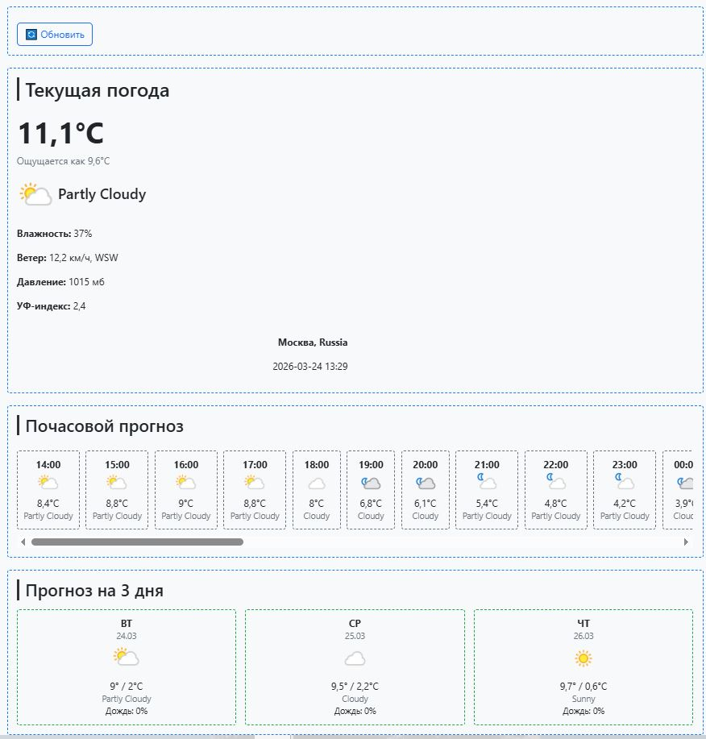

Тестовое задание: 
Написать погодное веб-приложение на .Net Framework, использовать можно любые библиотеки помогающие решить поставленную задача. В приложение должен быть интерфейс, и бекенд. 
UI 
• Отобразить один экран с погодной информацией: текущая, почасовая (показывать оставшиеся часы из текущего дня и все часы следующего), прогноз погоды на 3 дня. 
• Обработать показ загрузки и ошибку, если что-то пошло не так, с кнопкой повторного запроса 
• По дизайну никаких ограничений нет, все на ваш вкус. 
Геолокация и запросы 
• Геолокацию зафиксировать на использование города Москва 
• Данные получать из запросов API: 
http://api.weatherapi.com/v1/current... 
http://api.weatherapi.com/v1/forecast... 
Реализация графической составляющей на усмотрения кандидата, оформление должно быть понятным, не запутанным, но соответствовать тз. 
 
Реализация (3.5 часа): 
ASP.NET MVC (.NET Framework 4.8) 
Bootstrap 
 
Скриншот: 
